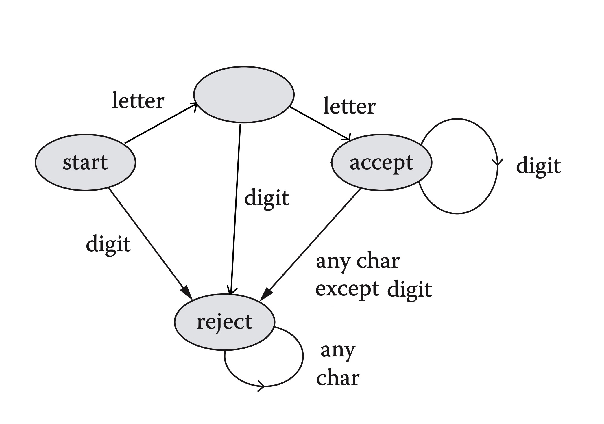

## Graph Modeling Applications

###

#### 1.3.1:
The minimum number of colors needed to color the vertices of this associated graph should be 3. This cannot be fewer, i.e. 2, because there is a triangle, e.g. BCF, which needs at least to color its vertices so that each vertex has a unique color.

#### 1.3.2:
The wrongs of the given computer program is:
- The vertex following the start point need another resource that we cannot determine when it will process. It will stuck here since this vertex cannot be processed.

#### 1.3.3:
Since the buyer firstly bought O's, the probability that the next three purchases are W's, O's and then W's is:
`0.4*0.3*0.4 = 0.048`

#### 1.3.4:

#### 1.3.5:
The strings accepted by the finite-state recognizer are strings which contains an odd number of `1`. 

#### 1.3.6:
Each appropriate team can be denoted by a edge with two vertices are two people sharing the same language.
The group formulation can be achieved by removing edges and their vertices one by one so that we do not obtain any vertex without any edge connected, or one vertex at the end in case `n` is odd.

#### 1.3.7:
Since we need to consider about the meeting times, it is a good chance to make use of interval graphs.
Each vertex in the graph represents a meeting time interval of a person in a committee. The time interval for every person in a committee should be the same. Two vertices are adjacent if their intervals overlap. The vertices representing the meeting times of a person should be color in a same color.
The condition for the graph is that there is no edges connecting two vertices that have the same color, which means that the person (characterized by that color) is working on two committees.

#### 1.3.8:

#### 1.3.9:
- Solution 1: We situate seven cities in a `Oxy` coordinate so that the distances between cities is the same as mentioned in the table (i.e., we random a city `A`, then choose a random position on the `A`'s circumference with the radius is the distance between `A` and `B`, etc.). The positions to place the generators are the centroids when we do the k-means to cluster the 8 points on the graph into 3 clusters.

- 

